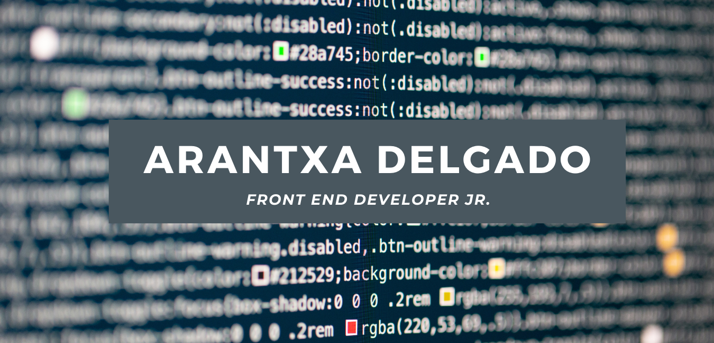
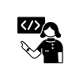

# Hi there 👋

After years in a job that did not let me grow I have found a new ✨illusion✨ in programming.

My name is Arantxa and I'm currently curently searching for my *frist job* as a front end developer.

## 🌱 Tools and languages

## 📫 How to reach me:

