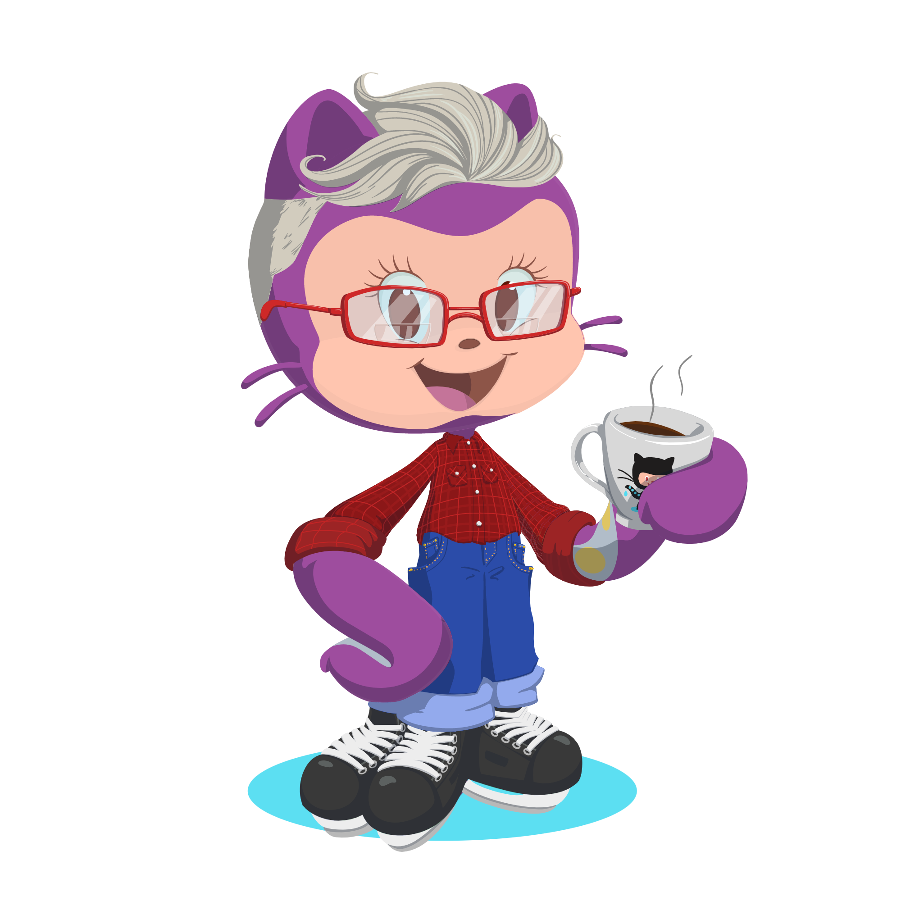

# Hi there 👋

 

 

My name is Arantxa and I'm a front end developer.

Teamwork and respect are the daily maxims and my great allies. Discovering the world of front programming I also discovered a ✨illusion✨ to improve and learn, to develop a completely new professional career to which I have devoted myself.

## Tools and languages

## Languages

## Tools

## Currently learning

## Projects

###  My projects

- <a href="https://drag-race-game-lfr8yjl4k-arantxadr.vercel.app/" target="_blank"> DragRace Game<a>
- <a href="https://arantxadr.github.io/Buscador-series/" target="_blank"> Buscador de series <a>
- <a href="https://arantxadr.github.io/Rick-Morty-search/#/" target="_blank"> Rick & Morty characters search <a>

### Team projects 

- <a href="https://arantxadr.github.io/Las-chicas-del-coding" target="_blank"> Las chicas del coding <a>
- <a href="https://arantxadr.github.io/Catrinas-awesome-profile-cards/" target="_blank"> Catrina´s awesome profile cards <a>
- <a href="https://arantxadr.github.io/not-Surrender/#/" target="_blank"> <!SURRENDER> <a>

## How to reach me:

   

---

